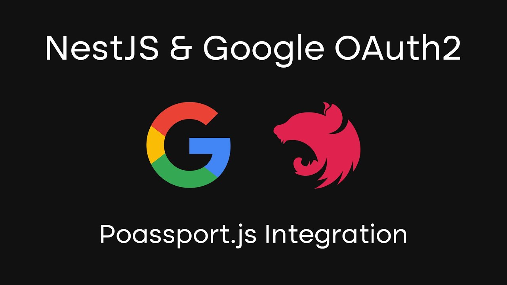

[circleci-image]: https://img.shields.io/circleci/build/github/nestjs/nest/master?token=abc123def456
[circleci-url]: https://circleci.com/gh/nestjs/nest

## Description

[Autenticação com o google]() Este projeto implementa a autenticação com o google e gera o token após o login do usuário, para funcionar deve ser informado o client id e o client secrect do google, esse [link](https://help.vtex.com/pt/tutorial/cadastrar-client-id-e-client-secret-para-login-com-google--1lBgDmetUM4goie6mYEOK6) mostra um exemplo de criar criar essas credenciais.

## Project setup

```bash
$ npm install
```

## Compile and run the project

```bash
# development
$ npm run start

# watch mode
$ npm run dev

# production mode
$ npm run start:prod
```

## Run tests

```bash
# unit tests
$ npm run test

# e2e tests
$ npm run test:e2e

# test coverage
$ npm run test:cov
```

## Deployment

Quando estiver pronto para implantar seu aplicativo NestJS na produção, há algumas etapas importantes que você pode seguir para garantir que ele seja executado da forma mais eficiente possível. Confira a [documentação de implantação](https://docs.nestjs.com/deployment) para obter mais informações.

Se estiver procurando uma plataforma baseada em nuvem para implantar seu aplicativo NestJS, confira [Mau](https://mau.nestjs.com), nossa plataforma oficial para implantar aplicativos NestJS na AWS. Mau torna a implantação direta e rápida, exigindo apenas algumas etapas simples:

```bash
$ npm install -g mau
$ mau deploy
```

Com o Mau, você pode implantar seu aplicativo em apenas alguns cliques, permitindo que você se concentre na criação de recursos em vez de gerenciar a infraestrutura.
